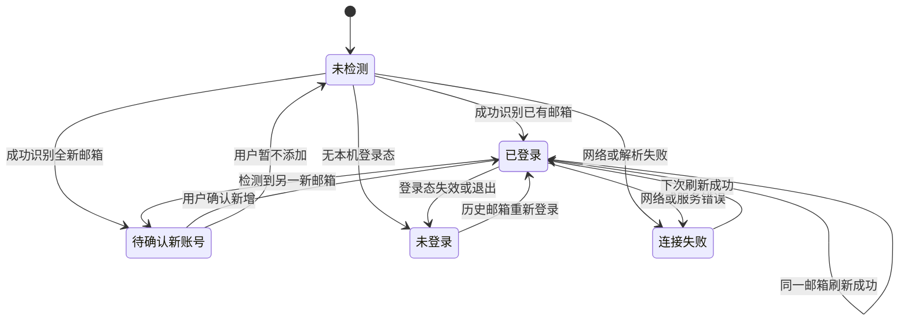

# 智额全会员多账号 Implementation Plan

> **For agentic workers:** REQUIRED SUB-SKILL: Use superpowers:subagent-driven-development (recommended) or superpowers:executing-plans to implement this plan task-by-task. Steps use checkbox (`- [ ]`) syntax for tracking.

**Goal:** 让智额的每个会员支持任意数量账号；同一时间只读取本机当前可用账号，其他账号保留最后一次成功额度并显示“未登录”。

**Architecture:** 保留现有单账号 Provider 和探针，通过 `ProviderAccountCoordinator` 在 `QuotaMonitor` 层统一管理账号识别、历史快照、待确认账号和显示选择。OAuth、CLI 和浏览器登录型会员不复制登录凭证；手动 API Key 型会员按账号隔离保存到系统钥匙串。

**Tech Stack:** Swift 6、SwiftUI、Observation、Tuist、macOS 15+、JSON 本地缓存、macOS Keychain；Windows 后续使用 Tauri 2、React、TypeScript、Rust、Windows Credential Manager。

## Global Constraints

- 账号数量使用数组模型，不写死“最多两个”。
- 同一 Provider 内，标准化邮箱唯一：去除首尾空格并转小写。
- 全新邮箱只能新增，任何检测流程都不得自动替换旧账号。
- 前台发现新账号时询问是否新增；后台发现时只记录待确认状态。
- 已知邮箱重新出现时更新原账号，不创建重复账号。
- OAuth、CLI、浏览器登录型会员不得复制登录凭证。
- 读不到账号时保留最后快照，显示“未登录”。
- 网络失败显示“连接失败”，不能误报为“未登录”。
- 未登录、连接失败和历史快照不参与实时菜单栏状态、最差额度计算和告警。
- 套餐名称、续费日期和显示名称改为账号级配置。
- 邮箱、快照和账号配置仅保存在本机，不上传。
- 日志中不得输出完整邮箱、Token、Cookie、认证文件内容。
- Mac 先完成闭环，再做 Windows 对齐。
- 默认 `local-only`；本计划不授权提交、发布或更新用户安装。

---

## 1. 已确认的项目现状

当前智额有 18 个内置会员：

```text
codex, kimi, minimax, grok,
claude, gemini, copilot, cursor, antigravity,
zai, bedrock, alibaba, mimo,
ampcode, kiro, mistral, opencode-go, omp
```

现有基础：

- `Apps/Mac/Sources/Domain/Provider/MultiAccountSupport.swift` 已定义多账号 Provider 协议，但没有具体 Provider 接入。
- `Apps/Mac/Sources/Domain/Provider/MultiAccountSettingsRepository.swift` 已定义账号配置模型，但 `JSONSettingsRepository` 尚未实现。
- `Apps/Mac/Sources/App/Views/Settings/AccountManagementCard.swift` 和 `Apps/Mac/Sources/App/Views/AccountPickerView.swift` 已有 UI 骨架，但没有接到菜单和设置入口。
- 所有具体 Provider 仍为单账号实现。
- `UsageSnapshot` 只存在内存，重启智额后丢失。
- 套餐名称和续费日期目前按 Provider 保存，不能区分两个同类型会员。
- Codex 当前只读取固定的 `~/.codex/auth.json`。
- 项目原则是本机优先、不建云账号、不上传密钥和用量。

### 1.1 架构选择

本需求不是“同时刷新多份凭证”，而是“跟踪当前登录账号并保留历史”。因此：

- 不强制 18 个 Provider 全部实现 `MultiAccountProvider`。
- 新增统一的 `ProviderAccountCoordinator`，由 `QuotaMonitor` 在每次刷新后更新账号档案。
- 保留 `MultiAccountProvider`，供未来真正能同时返回多个账号的 Provider 使用。
- OMP 继续使用自己现有的多账号分组，不重复制造账号记录。

---

## 2. 用户行为合同

### 2.1 账号发现规则

| 场景 | 智额行为 |
|---|---|
| 第一次成功检测到邮箱 | 自动建立第一个账号 |
| 邮箱与当前记录一致 | 更新对应账号额度和最后在线时间 |
| 邮箱属于历史账号 | 更新历史账号，并将其标记为当前登录 |
| 前台检测到全新邮箱 | 显示“发现新账号”，等待用户确认新增 |
| 后台检测到全新邮箱 | 不修改账号列表，保存为待确认发现 |
| 用户确认新增 | 建立新账号，旧账号保留并显示未登录 |
| 用户暂不添加 | 不保存快照到任何旧账号，不替换数据 |
| 未找到登录态 | 保留所有旧快照，标记未登录 |
| 网络、超时或解析失败 | 保留快照，标记连接失败 |
| 无法获得邮箱 | 要求用户选择已有账号或填写邮箱 |
| 重复导入同一邮箱 | 更新原记录，不增加账号 |
| 用户不再使用旧账号 | 在账号管理中明确删除 |

### 2.2 状态机



### 2.3 最终界面

```text
ChatGPT / Codex（2）
├── personal@example.com   已登录 · 刚刚更新
└── work@example.com       未登录 · 上次更新 2 天前

[添加账号]
```

账号详情展示：

- 邮箱或用户备注；
- 套餐名称；
- 续费日期；
- 当前连接状态；
- 最后成功更新时间；
- 最后一次额度快照；
- 删除账号入口。

---

## 3. 账号添加方式

### 3.1 本机登录型

适用于 Codex、Claude、Grok、Gemini、Cursor、Antigravity、AmpCode、Kiro 等。

1. 用户点击“添加账号”。
2. 智额显示对应平台的切换登录说明。
3. 用户在 CLI 或客户端切换账号。
4. 回到智额点击“检测当前登录”。
5. 智额验证邮箱或外部账号 ID。
6. 新邮箱进入确认新增；已有邮箱直接匹配。
7. 智额不复制外部认证文件。

### 3.2 手动密钥型

适用于 MiniMax、Copilot、Z.ai、阿里云、部分 Kimi/MiMo 模式。

1. 用户点击“添加账号”。
2. 填写邮箱、备注及 API Key/Cookie。
3. 智额先调用接口验证凭证。
4. 验证成功后才保存账号。
5. 密钥使用账号级 Keychain 项保存。
6. 选择账号时切换智额使用的密钥，但后台不并发刷新其他账号。

Keychain 命名：

```text
provider:<providerId>:account:<accountId>:api-key
provider:<providerId>:account:<accountId>:cookie
provider:<providerId>:account:<accountId>:token
```

### 3.3 Profile/路径型

适用于 AWS Bedrock、Z.ai 配置文件、Mistral 日志目录等。

- 每个账号保存独立 Profile 名称或配置路径。
- 不保存 AWS Secret 等敏感内容。
- 如果数据源本身没有邮箱，要求用户填写邮箱或账号备注。
- AWS 可将 Profile 名作为例外身份标识。

---

## 4. Provider 接入矩阵

| Provider | 添加方式 | 自动身份 | 无法识别时 |
|---|---|---|---|
| Codex | 切换 CLI 登录后检测 | `id_token` 邮箱、`account_id` | 用户确认邮箱 |
| Kimi | CLI/浏览器切换或手动 Key | 尝试接口身份 | 手动邮箱 |
| MiniMax | 手动添加 API Key | 接口可返回则使用 | 必填邮箱 |
| Grok | 切换 Grok 登录后检测 | 认证文件已有邮箱 | 手动邮箱 |
| Claude | 切换 Claude Code 登录 | `~/.claude.json`/CLI 邮箱 | 手动邮箱 |
| Gemini | 切换 Gemini CLI 登录 | OAuth 身份若可得 | 手动邮箱 |
| Copilot | 手动 PAT + GitHub 用户名 | GitHub 用户名 | 用户填写邮箱 |
| Cursor | 切换 Cursor 客户端账号 | JWT `userId` | 首次关联邮箱 |
| Antigravity | 切换客户端账号 | `userStatus.email` | 手动邮箱 |
| Z.ai | 手动 Key/配置路径 | 接口可返回则使用 | 手动邮箱 |
| Bedrock | 选择 AWS Profile | Profile/AWS Account ID | Profile 作为身份 |
| Alibaba | 切换浏览器或手动 Key/Cookie | 账号接口若可得 | 手动邮箱 |
| MiMo | 切换浏览器或手动 Cookie | Cookie 中 `userId` | 首次关联邮箱 |
| AmpCode | 切换 CLI 登录 | `Signed in as` 邮箱 | 手动邮箱 |
| Kiro | 切换 CLI 登录 | 当前输出若可得 | 手动邮箱 |
| Mistral | 独立日志目录 | 无稳定邮箱 | 手动绑定目录 |
| OpenCode Go | 独立数据库/当前登录 | 数据库身份若可得 | 手动绑定 |
| OMP | 保留现有多账号分组 | 输出中的 email/accountId | 不重复建立 OMP 子账号 |
| 用户扩展 | Manifest 声明 | `accountEmail`/`externalAccountId` | 手动绑定 |

---

## 5. 数据模型与存储

### 5.1 领域类型

创建 `Apps/Mac/Sources/Domain/Provider/Account/AccountIdentity.swift`：

```swift
public enum AccountIdentitySource: String, Sendable, Codable {
    case localLogin
    case providerResponse
    case manualSecret
    case profile
    case configPath
    case userAssigned
}

public struct AccountIdentity: Sendable, Equatable {
    public let providerId: String
    public let email: String?
    public let externalAccountId: String?
    public let source: AccountIdentitySource

    public var normalizedEmail: String? {
        email?
            .trimmingCharacters(in: .whitespacesAndNewlines)
            .lowercased()
    }
}
```

创建 `Apps/Mac/Sources/Domain/Provider/Account/AccountDiscoveryEvent.swift`：

```swift
public enum AccountDiscoveryEvent: Sendable, Equatable {
    case firstAccountCreated(accountId: String)
    case matchedExisting(accountId: String)
    case pendingNewIdentity(AccountIdentity)
    case requiresAssignment(AccountIdentity)
    case noChange
}
```

创建 `Apps/Mac/Sources/Domain/Provider/Account/AccountConnectionState.swift`：

```swift
public enum AccountConnectionState: String, Sendable, Codable {
    case notChecked
    case signedIn
    case signedOut
    case connectionFailed
    case pendingConfirmation
}
```

创建 `Apps/Mac/Sources/Domain/Provider/Account/ProviderAccountState.swift`，字段如下：

```swift
public struct ProviderAccountState: Sendable, Equatable, Identifiable {
    public let account: ProviderAccount
    public var connectionState: AccountConnectionState
    public var snapshot: UsageSnapshot?
    public var lastSeenAt: Date?
    public var lastSuccessfulRefreshAt: Date?
    public var lastErrorDescription: String?
    public var isSelectedForDisplay: Bool
    public var isCurrentLocalLogin: Bool

    public var id: String { account.id }
}
```

### 5.2 账号配置

扩展 `ProviderAccountConfig`：

```text
accountId              智额生成的稳定 UUID
label                  用户备注
email                  标准化邮箱
externalAccountId      平台返回的技术账号 ID
sourceKind             localLogin/manualSecret/profile/configPath
probeConfig            Profile、配置路径等非敏感信息
planLabel              账号套餐名称
renewalDate            账号续费日期
createdAt              创建时间
lastSeenAt             最后检测到该身份的时间
isEnabled              是否在智额中显示
```

`accountId` 不直接使用邮箱，以便用户修改邮箱后仍保持原账号历史。

### 5.3 快照缓存

创建 `Apps/Mac/Sources/Infrastructure/Storage/AccountSnapshotCache.swift`。

缓存文件：

```text
~/.smartquota/account-snapshots.json
```

要求：

- `schemaVersion = 1`；
- 按 `accountId` 保存最后成功快照；
- 原子写入；
- 文件权限 `0600`；
- 损坏时忽略并记录脱敏错误；
- 不保存 Token、Cookie、认证文件内容；
- 删除账号时同步删除缓存。

`PersistedUsageSnapshotV1` 必须覆盖：

- `UsageSnapshot` 的 provider、捕获时间、账号信息和套餐；
- `UsageQuota` 的 quotaKey、百分比、重置时间、窗口、金额和分组字段；
- `CostUsage` 的 kind、成本、预算、时长、代码行和重置字段；
- Bedrock 的模型 ID、名称、厂商、价格、调用数、Token、区域、周期和预算；
- `DailyUsageReport` 的今日和前一日全部统计字段；
- `ExtensionMetric` 全部字段。

`QuotaType` 使用现有 `quotaKey` 序列化，避免直接编码关联枚举。

---

## 6. 核心接口

创建 `Apps/Mac/Sources/Domain/Provider/Account/ProviderAccountCoordinator.swift`：

```swift
@MainActor
@Observable
public final class ProviderAccountCoordinator {
    public func ingest(
        providerId: String,
        snapshot: UsageSnapshot,
        context: RefreshKind
    ) -> AccountDiscoveryEvent

    public func markAuthenticationUnavailable(providerId: String)
    public func markConnectionFailure(providerId: String, error: Error)

    public func confirmPendingAccount(providerId: String) -> ProviderAccount?
    public func dismissPendingAccount(providerId: String)

    public func accounts(for providerId: String) -> [ProviderAccountState]
    public func selectAccount(providerId: String, accountId: String)
    public func removeAccount(providerId: String, accountId: String)
}
```

匹配顺序：

1. 标准化邮箱完全一致；
2. 邮箱缺失时匹配 `externalAccountId`；
3. 两者都缺失时要求用户指定；
4. 邮箱一致但外部 ID 变化时更新外部 ID，不创建新账号；
5. 邮箱不同则产生待确认事件，不覆盖任何账号。

---

## 7. Implementation Tasks

### Task 1: 建立产品行为测试

**Files:**

- Modify: `docs/architecture/USER_BEHAVIORS.md`
- Create: `Apps/Mac/Tests/AcceptanceTests/MultiAccountMembershipSpec.swift`

**Interfaces:**

- Consumes: 现有 `QuotaMonitor`、`AIProvider`、`UsageSnapshot` 测试辅助对象。
- Produces: 多账号功能的外层 BDD 验收合同。

- [ ] **Step 1: 写首次账号自动建立的失败验收测试**

验证首次交互刷新返回 `first@example.com` 后，Codex 账号列表只有一条且状态为 `signedIn`。

- [ ] **Step 2: 写相同邮箱不重复新增的失败验收测试**

连续两次返回大小写和空格不同的同一邮箱，账号数量必须保持为一。

- [ ] **Step 3: 写新邮箱待确认的失败验收测试**

已有账号 A 后交互刷新出账号 B，账号列表仍只有 A，并产生 `pendingConfirmation`。

- [ ] **Step 4: 写后台不得自动新增的失败验收测试**

后台刷新出现账号 B 时，不改变账号数量、不切换当前显示账号。

- [ ] **Step 5: 写历史快照保留的失败验收测试**

账号 A 退出登录后仍显示最后额度和时间，但状态为 `signedOut`。

- [ ] **Step 6: 写告警隔离的失败验收测试**

历史账号 A 的过期低额度不得触发告警；当前登录账号 B 的新快照可以触发。

- [ ] **Step 7: 运行测试并确认失败原因正确**

Run:

```bash
cd Apps/Mac
tuist generate
xcodebuild -workspace SmartQuota.xcworkspace \
  -scheme SmartQuota \
  -destination 'platform=macOS' \
  test \
  -only-testing:AcceptanceTests/MultiAccountMembershipSpec
```

Expected: FAIL，因为账号协调器和持久化尚未实现；不能因测试工程配置错误而失败。

- [ ] **Step 8: Commit**

```bash
git add docs/architecture/USER_BEHAVIORS.md Apps/Mac/Tests/AcceptanceTests/MultiAccountMembershipSpec.swift
git commit -m "test(mac): define multi-account membership behavior"
```

### Task 2: 建立账号领域模型

**Files:**

- Create: `Apps/Mac/Sources/Domain/Provider/Account/AccountIdentity.swift`
- Create: `Apps/Mac/Sources/Domain/Provider/Account/AccountConnectionState.swift`
- Create: `Apps/Mac/Sources/Domain/Provider/Account/ProviderAccountState.swift`
- Modify: `Apps/Mac/Sources/Domain/Provider/ProviderAccount.swift`
- Modify: `Apps/Mac/Sources/Domain/Provider/MultiAccountSettingsRepository.swift`
- Modify: `Apps/Mac/Sources/Domain/Provider/UsageSnapshot.swift`
- Test: `Apps/Mac/Tests/DomainTests/Provider/AccountIdentityTests.swift`

**Interfaces:**

- Consumes: 现有 `ProviderAccount`、`UsageSnapshot`、`ProviderAccountConfig`。
- Produces: `AccountIdentity`、`AccountConnectionState`、`ProviderAccountState` 和可选的快照账号技术 ID。

- [ ] **Step 1: 写邮箱标准化失败测试**

输入 `" Alice@Example.COM "`，期望 `normalizedEmail == "alice@example.com"`。

- [ ] **Step 2: 写账号稳定 ID 失败测试**

修改邮箱和备注后，智额生成的 `accountId` 必须保持不变。

- [ ] **Step 3: 实现领域类型和兼容初始化参数**

给 `UsageSnapshot` 增加默认值为 `nil` 的 `accountExternalId` 和 `accountIdentitySource`，保证现有调用无需一次性重写。

- [ ] **Step 4: 运行 Domain 测试**

Run:

```bash
cd Apps/Mac
xcodebuild -workspace SmartQuota.xcworkspace \
  -scheme SmartQuota \
  -destination 'platform=macOS' \
  test \
  -only-testing:DomainTests/AccountIdentityTests
```

Expected: PASS。

- [ ] **Step 5: Commit**

```bash
git add Apps/Mac/Sources/Domain/Provider Apps/Mac/Tests/DomainTests/Provider/AccountIdentityTests.swift
git commit -m "feat(domain): add provider account identity model"
```

### Task 3: 实现账号元数据和快照持久化

**Files:**

- Modify: `Apps/Mac/Sources/Infrastructure/Storage/JSONSettingsRepository.swift`
- Create: `Apps/Mac/Sources/Infrastructure/Storage/AccountSnapshotCache.swift`
- Create: `Apps/Mac/Sources/Infrastructure/Storage/PersistedUsageSnapshotV1.swift`
- Test: `Apps/Mac/Tests/InfrastructureTests/Storage/ProviderAccountRepositoryTests.swift`
- Test: `Apps/Mac/Tests/InfrastructureTests/Storage/AccountSnapshotCacheTests.swift`

**Interfaces:**

- Consumes: Task 2 的 `ProviderAccountConfig` 和 `UsageSnapshot`。
- Produces: `JSONSettingsRepository: MultiAccountSettingsRepository` 与 `AccountSnapshotCache`。

- [ ] **Step 1: 写账号 CRUD 和选中账号失败测试**
- [ ] **Step 2: 写完整快照往返编码失败测试**
- [ ] **Step 3: 写损坏缓存安全降级失败测试**
- [ ] **Step 4: 写删除单一账号不影响其他缓存的失败测试**
- [ ] **Step 5: 实现 `providers.<providerId>.accounts` 持久化**
- [ ] **Step 6: 实现 `providers.<providerId>.selectedAccountId` 持久化**
- [ ] **Step 7: 实现 `PersistedUsageSnapshotV1` 双向映射**
- [ ] **Step 8: 实现原子写入和 `0600` 权限**
- [ ] **Step 9: 运行 Infrastructure 测试**

Run:

```bash
cd Apps/Mac
xcodebuild -workspace SmartQuota.xcworkspace \
  -scheme SmartQuota \
  -destination 'platform=macOS' \
  test \
  -only-testing:InfrastructureTests/ProviderAccountRepositoryTests \
  -only-testing:InfrastructureTests/AccountSnapshotCacheTests
```

Expected: PASS；临时测试目录中不存在任何 secret 字段。

- [ ] **Step 10: Commit**

```bash
git add Apps/Mac/Sources/Infrastructure/Storage Apps/Mac/Tests/InfrastructureTests/Storage
git commit -m "feat(storage): persist account profiles and last snapshots"
```

### Task 4: 实现账号发现状态机

**Files:**

- Create: `Apps/Mac/Sources/Domain/Provider/Account/ProviderAccountCoordinator.swift`
- Create: `Apps/Mac/Sources/Domain/Provider/Account/AccountDiscoveryEvent.swift`
- Test: `Apps/Mac/Tests/DomainTests/Provider/ProviderAccountCoordinatorTests.swift`

**Interfaces:**

- Consumes: 账号 Repository、快照 Repository、`AccountIdentity`、现有 `RefreshKind`。
- Produces: `ProviderAccountCoordinator.ingest`、确认、忽略、选择和删除账号操作。

- [ ] **Step 1: 写首次账号自动创建失败测试**
- [ ] **Step 2: 写相同邮箱更新失败测试**
- [ ] **Step 3: 写历史邮箱重新激活失败测试**
- [ ] **Step 4: 写全新邮箱待确认失败测试**
- [ ] **Step 5: 写前台和后台上下文差异失败测试**
- [ ] **Step 6: 写认证失效与网络失败状态差异测试**
- [ ] **Step 7: 实现最小状态机**
- [ ] **Step 8: 实现确认新增和暂不添加**
- [ ] **Step 9: 实现选择、删除及缓存清理**
- [ ] **Step 10: 运行测试**

Run:

```bash
cd Apps/Mac
xcodebuild -workspace SmartQuota.xcworkspace \
  -scheme SmartQuota \
  -destination 'platform=macOS' \
  test \
  -only-testing:DomainTests/ProviderAccountCoordinatorTests
```

Expected: PASS。

- [ ] **Step 11: Commit**

```bash
git add Apps/Mac/Sources/Domain/Provider/Account Apps/Mac/Tests/DomainTests/Provider/ProviderAccountCoordinatorTests.swift
git commit -m "feat(domain): coordinate account discovery and history"
```

### Task 5: 接入 QuotaMonitor、告警和菜单栏状态

**Files:**

- Modify: `Apps/Mac/Sources/Domain/Monitor/QuotaMonitor.swift`
- Modify: `Apps/Mac/Sources/Domain/Monitor/QuotaAlerter.swift`
- Modify: `Apps/Mac/Sources/App/StatusItemLabelDriver.swift`
- Modify: `Apps/Mac/Sources/App/SmartQuotaApp.swift`
- Test: `Apps/Mac/Tests/DomainTests/Monitor/QuotaMonitorTests.swift`

**Interfaces:**

- Consumes: `ProviderAccountCoordinator`。
- Produces: 刷新结果到账号状态的统一路由，以及账号级告警键。

- [ ] **Step 1: 写成功刷新调用账号协调器的失败测试**
- [ ] **Step 2: 写认证错误标记未登录的失败测试**
- [ ] **Step 3: 写网络错误保留快照的失败测试**
- [ ] **Step 4: 写历史快照不参与 overallStatus 的失败测试**
- [ ] **Step 5: 写告警键使用 `providerId.accountId:kind` 的失败测试**
- [ ] **Step 6: 注入并接通 Coordinator**
- [ ] **Step 7: 更新菜单栏只消费本次有效快照**
- [ ] **Step 8: 运行 QuotaMonitor 测试**

Run:

```bash
cd Apps/Mac
xcodebuild -workspace SmartQuota.xcworkspace \
  -scheme SmartQuota \
  -destination 'platform=macOS' \
  test \
  -only-testing:DomainTests/QuotaMonitorTests
```

Expected: PASS；原有单账号刷新行为保持通过。

- [ ] **Step 9: Commit**

```bash
git add Apps/Mac/Sources/Domain/Monitor Apps/Mac/Sources/App/SmartQuotaApp.swift Apps/Mac/Sources/App/StatusItemLabelDriver.swift Apps/Mac/Tests/DomainTests/Monitor/QuotaMonitorTests.swift
git commit -m "feat(monitor): route quota refreshes through account coordinator"
```

### Task 6: 完成 Codex 试点

**Files:**

- Modify: `Apps/Mac/Sources/Infrastructure/Codex/CodexCredentialLoader.swift`
- Modify: `Apps/Mac/Sources/Infrastructure/Codex/CodexAPIUsageProbe.swift`
- Modify: `Apps/Mac/Sources/Infrastructure/Codex/CodexUsageProbe.swift`
- Modify: `Apps/Mac/Tests/InfrastructureTests/Codex/CodexCredentialLoaderTests.swift`
- Modify: `Apps/Mac/Tests/InfrastructureTests/Codex/CodexAPIUsageProbeTests.swift`

**Interfaces:**

- Consumes: `UsageSnapshot.accountExternalId` 和账号身份来源。
- Produces: Codex 当前本机账号的邮箱或 `account_id` 身份。

- [ ] **Step 1: 写正常 `id_token` 邮箱解析失败测试**
- [ ] **Step 2: 写 malformed JWT 安全失败测试**
- [ ] **Step 3: 写无邮箱但有 `account_id` 的测试**
- [ ] **Step 4: 只解析 JWT payload 的非敏感声明**
- [ ] **Step 5: API 与 RPC 模式输出一致的账号字段**
- [ ] **Step 6: 确认日志不输出原始 Token 和完整邮箱**
- [ ] **Step 7: 用两个伪造账号夹具验证新增和历史恢复**
- [ ] **Step 8: 运行 Codex 测试**

Run:

```bash
cd Apps/Mac
xcodebuild -workspace SmartQuota.xcworkspace \
  -scheme SmartQuota \
  -destination 'platform=macOS' \
  test \
  -only-testing:InfrastructureTests/CodexCredentialLoaderTests \
  -only-testing:InfrastructureTests/CodexAPIUsageProbeTests
```

Expected: PASS。

- [ ] **Step 9: Commit**

```bash
git add Apps/Mac/Sources/Infrastructure/Codex Apps/Mac/Tests/InfrastructureTests/Codex
git commit -m "feat(codex): detect current account for membership history"
```

### Task 7: 完成多账号 UI

**Files:**

- Modify: `Apps/Mac/Sources/App/Views/AccountPickerView.swift`
- Modify: `Apps/Mac/Sources/App/Views/Settings/AccountManagementCard.swift`
- Create: `Apps/Mac/Sources/App/Views/Settings/AddAccountSheet.swift`
- Create: `Apps/Mac/Sources/App/Views/PendingAccountBanner.swift`
- Modify: `Apps/Mac/Sources/App/Views/MenuContentView.swift`
- Modify: `Apps/Mac/Sources/App/Views/Settings/QuotaDetectionConfigSection.swift`
- Modify: `Apps/Mac/Sources/App/Localization/L10n.swift`

**Interfaces:**

- Consumes: `QuotaMonitor` 暴露的账号状态、待确认账号和账号操作。
- Produces: 账号选择、添加确认、未登录展示和删除交互。

- [ ] **Step 1: Provider 标签显示账号数量**
- [ ] **Step 2: 详情页接入账号选择器**
- [ ] **Step 3: 区分已登录、未登录、连接失败和待确认状态**
- [ ] **Step 4: 新账号确认只提供“添加为新账号”和“暂不添加”**
- [ ] **Step 5: 添加账号流程按 Provider 能力显示说明**
- [ ] **Step 6: 删除账号增加二次确认**
- [ ] **Step 7: 所有新文案进入 L10n**
- [ ] **Step 8: 增加 VoiceOver、键盘焦点和小窗口滚动验证**
- [ ] **Step 9: Build App**

Run:

```bash
cd Apps/Mac
xcodebuild -workspace SmartQuota.xcworkspace \
  -scheme SmartQuota \
  -configuration Debug \
  -destination 'platform=macOS' \
  build
```

Expected: BUILD SUCCEEDED。

- [ ] **Step 10: Commit**

```bash
git add Apps/Mac/Sources/App/Views Apps/Mac/Sources/App/Localization/L10n.swift
git commit -m "feat(mac): add account history and discovery UI"
```

### Task 8: 迁移套餐、续费日和账号选择

**Files:**

- Modify: `Apps/Mac/Sources/Infrastructure/Storage/JSONSettingsRepository.swift`
- Modify: `Apps/Mac/Sources/App/Settings/AppSettings.swift`
- Modify: `Apps/Mac/Sources/App/Views/MembershipUI/MembershipPlanStore.swift`
- Modify: `Apps/Mac/Sources/App/Views/MembershipUI/ProviderSummaryCardView.swift`
- Modify: `Apps/Mac/Sources/App/Views/Settings/SettingsMembershipSection.swift`
- Test: `Apps/Mac/Tests/InfrastructureTests/Storage/MultiAccountMigrationTests.swift`

**Interfaces:**

- Consumes: 账号级配置 Repository。
- Produces: 账号级 `planLabel`、`renewalDate` 和幂等旧设置迁移。

- [ ] **Step 1: 写旧 Provider 设置迁移失败测试**
- [ ] **Step 2: 写重复迁移不重复创建账号的失败测试**
- [ ] **Step 3: 写两个账号套餐互不影响的失败测试**
- [ ] **Step 4: 将旧套餐和续费日复制给首次识别账号**
- [ ] **Step 5: 保留旧键一个兼容版本作为读取回退**
- [ ] **Step 6: 没有识别到账号时不创建空账号**
- [ ] **Step 7: 运行迁移测试**

Run:

```bash
cd Apps/Mac
xcodebuild -workspace SmartQuota.xcworkspace \
  -scheme SmartQuota \
  -destination 'platform=macOS' \
  test \
  -only-testing:InfrastructureTests/MultiAccountMigrationTests
```

Expected: PASS。

- [ ] **Step 8: Commit**

```bash
git add Apps/Mac/Sources/Infrastructure/Storage Apps/Mac/Sources/App/Settings Apps/Mac/Sources/App/Views/MembershipUI Apps/Mac/Sources/App/Views/Settings/SettingsMembershipSection.swift Apps/Mac/Tests/InfrastructureTests/Storage/MultiAccountMigrationTests.swift
git commit -m "feat(settings): migrate membership details to account scope"
```

### Task 9: 接入剩余 Mac Provider

**Files:**

- Modify: `Apps/Mac/Sources/Infrastructure/Grok/GrokCredentialLoader.swift`
- Modify: `Apps/Mac/Sources/Infrastructure/Grok/GrokUsageProbe.swift`
- Modify: `Apps/Mac/Sources/Infrastructure/Claude/ClaudeAccountInfoResolver.swift`
- Modify: `Apps/Mac/Sources/Infrastructure/Claude/ClaudeAPIUsageProbe.swift`
- Modify: `Apps/Mac/Sources/Infrastructure/Claude/ClaudeUsageProbe.swift`
- Modify: `Apps/Mac/Sources/Infrastructure/Antigravity/AntigravityUsageProbe.swift`
- Modify: `Apps/Mac/Sources/Infrastructure/AmpCode/AmpCodeUsageProbe.swift`
- Modify: `Apps/Mac/Sources/Infrastructure/Kimi/KimiCLIUsageProbe.swift`
- Modify: `Apps/Mac/Sources/Infrastructure/Kimi/KimiTokenProvider.swift`
- Modify: `Apps/Mac/Sources/Infrastructure/Kimi/KimiUsageProbe.swift`
- Modify: `Apps/Mac/Sources/Infrastructure/MiniMax/MiniMaxUsageProbe.swift`
- Modify: `Apps/Mac/Sources/Infrastructure/Copilot/CopilotInternalAPIProbe.swift`
- Modify: `Apps/Mac/Sources/Infrastructure/Copilot/CopilotUsageProbe.swift`
- Modify: `Apps/Mac/Sources/Infrastructure/Zai/ZaiUsageProbe.swift`
- Modify: `Apps/Mac/Sources/Infrastructure/Bedrock/BedrockUsageProbe.swift`
- Modify: `Apps/Mac/Sources/Infrastructure/Alibaba/AlibabaUsageProbe.swift`
- Modify: `Apps/Mac/Sources/Infrastructure/Alibaba/AlibabaBrowserCookieProvider.swift`
- Modify: `Apps/Mac/Sources/Infrastructure/MiMo/MiMoUsageProbe.swift`
- Modify: `Apps/Mac/Sources/Infrastructure/MiMo/MiMoBrowserCookieProvider.swift`
- Modify: `Apps/Mac/Sources/Infrastructure/Gemini/GeminiAPIProbe.swift`
- Modify: `Apps/Mac/Sources/Infrastructure/Gemini/GeminiCLIProbe.swift`
- Modify: `Apps/Mac/Sources/Infrastructure/Gemini/GeminiUsageProbe.swift`
- Modify: `Apps/Mac/Sources/Infrastructure/Cursor/CursorUsageProbe.swift`
- Modify: `Apps/Mac/Sources/Infrastructure/Kiro/KiroUsageProbe.swift`
- Modify: `Apps/Mac/Sources/Infrastructure/Mistral/MistralUsageProbe.swift`
- Modify: `Apps/Mac/Sources/Infrastructure/Mistral/VibeSessionLogAnalyzer.swift`
- Modify: `Apps/Mac/Sources/Infrastructure/OpenCode/OpenCodeUsageProbe.swift`
- Modify: `Apps/Mac/Sources/Infrastructure/Omp/OmpUsageProbe.swift`
- Modify: `Apps/Mac/Sources/Domain/Extension/ExtensionManifest.swift`
- Modify: `Apps/Mac/Sources/Domain/Extension/ExtensionProvider.swift`
- Modify: `Apps/Mac/Sources/Infrastructure/Extension/ScriptProbe.swift`
- Modify: `Apps/Mac/Sources/Domain/Provider/ProviderSettingsRepository.swift`
- Modify: `Apps/Mac/Sources/Infrastructure/Storage/JSONSettingsRepository.swift`
- Test: existing matching Provider test files under `Apps/Mac/Tests/InfrastructureTests/<Provider>/`, plus new identity-specific cases in those files.

**Interfaces:**

- Consumes: Task 2 的快照身份字段和 Task 3 的账号级 secret 约定。
- Produces: 全部内置 Provider 的当前身份或明确的人工绑定路径。

- [ ] **Step 1: 自动邮箱组接入**

接入 Grok、Claude、Antigravity、AmpCode；每个 Provider 增加相同账号和切换账号测试。

- [ ] **Step 2: 手动密钥/Profile 组接入**

接入 Kimi、MiniMax、Copilot、Z.ai、Bedrock、Alibaba、MiMo；Keychain 按 `providerId + accountId` 隔离，Profile、地区和 Probe Mode 改为账号级。

- [ ] **Step 3: 身份不完整组接入**

接入 Gemini、Cursor、Kiro、Mistral、OpenCode Go；有外部 ID 时保存 ID，首次由用户确认邮箱，无法证明身份时不得自动写入历史账号。

- [ ] **Step 4: 聚合和扩展组接入**

OMP 继续显示上游多账号分组；扩展协议增加可选 `accountEmail` 和 `externalAccountId`，老扩展保持兼容。

- [ ] **Step 5: 运行完整 Mac 测试**

Run:

```bash
cd Apps/Mac
xcodebuild -workspace SmartQuota.xcworkspace \
  -scheme SmartQuota \
  -destination 'platform=macOS' \
  test
```

Expected: AcceptanceTests、DomainTests、InfrastructureTests 全部通过。

- [ ] **Step 6: Commit automatic identity group**

```bash
git add Apps/Mac/Sources/Infrastructure/Grok Apps/Mac/Sources/Infrastructure/Claude Apps/Mac/Sources/Infrastructure/Antigravity Apps/Mac/Sources/Infrastructure/AmpCode Apps/Mac/Tests
git commit -m "feat(providers): add automatic account identity adapters"
```

- [ ] **Step 7: Commit managed configuration group**

```bash
git add Apps/Mac/Sources/Infrastructure/Kimi Apps/Mac/Sources/Infrastructure/MiniMax Apps/Mac/Sources/Infrastructure/Copilot Apps/Mac/Sources/Infrastructure/Zai Apps/Mac/Sources/Infrastructure/Bedrock Apps/Mac/Sources/Infrastructure/Alibaba Apps/Mac/Sources/Infrastructure/MiMo Apps/Mac/Tests
git commit -m "feat(providers): support account-scoped manual credentials"
```

- [ ] **Step 8: Commit manual assignment and extension group**

```bash
git add Apps/Mac/Sources/Infrastructure/Gemini Apps/Mac/Sources/Infrastructure/Cursor Apps/Mac/Sources/Infrastructure/Kiro Apps/Mac/Sources/Infrastructure/Mistral Apps/Mac/Sources/Infrastructure/OpenCode Apps/Mac/Sources/Infrastructure/Omp Apps/Mac/Sources/Domain/Extension Apps/Mac/Sources/Infrastructure/Extension Apps/Mac/Tests
git commit -m "feat(providers): support assigned account identity"
```

### Task 10: Windows 行为对齐

**Files:**

- Create: `Apps/Windows/src-tauri/src/accounts.rs`
- Create: `Apps/Windows/src-tauri/src/account_cache.rs`
- Modify: `Apps/Windows/src-tauri/src/models.rs`
- Modify: `Apps/Windows/src-tauri/src/settings.rs`
- Modify: `Apps/Windows/src-tauri/src/lib.rs`
- Modify: `Apps/Windows/src-tauri/src/secrets.rs`
- Modify: `Apps/Windows/src/App.tsx`
- Modify: `Apps/Windows/src/i18n.ts`

**Interfaces:**

- Consumes: 已在 Mac 验证的账号发现行为合同。
- Produces: Rust 账号状态机、持久化、Tauri 命令和 React 账号 UI。

- [ ] **Step 1: 在 Rust 中写相同邮箱匹配状态机测试**
- [ ] **Step 2: 给 `QuotaCard` 增加账号身份字段**
- [ ] **Step 3: 实现最后 `QuotaCard` 的账号级缓存**
- [ ] **Step 4: Windows Credential Manager 按账号隔离密钥**
- [ ] **Step 5: 增加账号列表、确认、选择、删除 Tauri 命令**
- [ ] **Step 6: React 增加账号选择、未登录和新增确认 UI**
- [ ] **Step 7: 运行 Rust 测试**

Run:

```bash
cd Apps/Windows/src-tauri
cargo test --lib
```

Expected: PASS。

- [ ] **Step 8: 运行前端构建**

Run:

```bash
cd Apps/Windows
npm run build
```

Expected: TypeScript 和 Vite build 通过。

- [ ] **Step 9: Commit**

```bash
git add Apps/Windows/src-tauri/src Apps/Windows/src/App.tsx Apps/Windows/src/i18n.ts
git commit -m "feat(windows): add multi-account membership history"
```

Windows Setup 必须在 Windows 或既有 CI 上验证；macOS 的 Rust/前端测试不能冒充安装包通过。

### Task 11: 文档、安全和隐私收尾

**Files:**

- Modify: `PRODUCT.md`
- Modify: `docs/USER_GUIDE.md`
- Modify: `docs/DEVELOPER.md`
- Modify: `docs/architecture/ARCHITECTURE.md`
- Modify: `SECURITY.md`

**Interfaces:**

- Consumes: 最终实现行为和真实验证证据。
- Produces: 用户说明、开发者说明、隐私边界和删除流程。

- [ ] **Step 1: 写明多账号不等于托管多份 OAuth 登录**
- [ ] **Step 2: 写明只有当前本机账号会刷新**
- [ ] **Step 3: 写明历史快照可能过期且不参与告警**
- [ ] **Step 4: 写明邮箱、额度、Keychain 和普通设置的存储边界**
- [ ] **Step 5: 写明账号删除和缓存清理流程**
- [ ] **Step 6: 写明每类 Provider 的添加方式**
- [ ] **Step 7: Commit**

```bash
git add PRODUCT.md docs/USER_GUIDE.md docs/DEVELOPER.md docs/architecture/ARCHITECTURE.md SECURITY.md
git commit -m "docs: document multi-account privacy and behavior"
```

### Task 12: 完整验证与本地交付

**Files:**

- Verify only; no source changes unless a failing test reveals an in-scope defect.

**Interfaces:**

- Consumes: Tasks 1–11 的实现。
- Produces: 分层验证结果，不包含未授权的远端发布。

- [ ] **Step 1: 运行完整 Mac 测试**

```bash
cd Apps/Mac
tuist generate
xcodebuild -workspace SmartQuota.xcworkspace \
  -scheme SmartQuota \
  -destination 'platform=macOS' \
  test
```

Expected: 全部测试通过。

- [ ] **Step 2: 运行 Debug build**

```bash
cd Apps/Mac
xcodebuild -workspace SmartQuota.xcworkspace \
  -scheme SmartQuota \
  -configuration Debug \
  -destination 'platform=macOS' \
  build
```

Expected: BUILD SUCCEEDED。

- [ ] **Step 3: 运行 Release build**

```bash
cd Apps/Mac
xcodebuild -workspace SmartQuota.xcworkspace \
  -scheme SmartQuota \
  -configuration Release \
  -destination 'platform=macOS' \
  build
```

Expected: BUILD SUCCEEDED。

- [ ] **Step 4: 执行真实双账号验收**

按下方运行时矩阵逐项留存结果；没有真实账号证据的 Provider 标为未验证。

- [ ] **Step 5: 检查差异和秘密**

```bash
git diff --check
git status --short
rg -n '(access_token|refresh_token|api[_-]?key|cookie)' . \
  -g '!**/.build/**' \
  -g '!**/DerivedData/**' \
  -g '!**/node_modules/**'
```

Expected: 无空白错误；秘密扫描结果只包含字段名、测试假值和文档说明，不包含真实凭证。

---

## 8. 真实运行验收矩阵

至少使用 Codex 和另一个可识别邮箱的 Provider 验证：

1. 登录账号 A，刷新并建立账号。
2. 退出智额后重新打开，确认 A 的快照仍在。
3. 在外部工具切换到账号 B。
4. 前台刷新，确认出现新增提示。
5. 暂不添加，确认 A 未被覆盖。
6. 再次检测并确认新增 B。
7. 确认 A 显示未登录并保留旧额度。
8. 切回 A，确认更新原记录而非新增第三条。
9. 模拟断网，确认显示连接失败。
10. 退出登录，确认显示未登录。
11. 删除 B，确认只删除 B 的配置、缓存和账号级密钥。
12. 检查菜单栏和告警不读取 A 的过期快照。
13. 检查浅色、深色、小窗口和全部支持语言。
14. 检查日志不存在完整邮箱、Token、Cookie。

---

## 9. 风险与回滚

| 风险 | 防护 | 回滚 |
|---|---|---|
| 错把新账号写入旧账号 | 邮箱优先匹配；新邮箱必须确认 | 删除误增记录，旧快照保持不变 |
| 旧设置迁移重复执行 | schemaVersion + 幂等测试 | 保留旧 Provider 键作为读取回退 |
| 缓存损坏 | 原子写入、版本字段、安全忽略 | 删除 `account-snapshots.json`，不影响登录凭证 |
| 网络错误被当作退出登录 | 错误类型分流 | 保留快照并显示连接失败 |
| 历史低额度触发误报 | 仅 fresh + signedIn 参与告警 | 禁用账号级告警状态 |
| 手动密钥串号 | Keychain 键包含 providerId 和 accountId | 删除单一账号 Keychain 项 |
| OAuth 凭证泄露 | 不复制 OAuth 文件、不输出原始 Token | 无智额侧 OAuth 副本需要清理 |
| UI 选择影响后台账号 | 区分 selectedForDisplay 与 currentLocalLogin | 后台刷新不修改显示选择 |
| Windows 与 Mac 行为漂移 | 复用同一验收场景表 | Windows 功能保持关闭直到对齐通过 |

---

## 10. 实施顺序

1. **M1：Mac 核心架构 + Codex 试点**
   - 账号模型、状态机、缓存、Codex、基础 UI。
2. **M2：Mac 全部 Provider**
   - 按自动身份、手动凭证、人工绑定三组完成。
3. **M3：Mac 回归与迁移**
   - 套餐/续费日迁移、告警、菜单栏、真实双账号 QA。
4. **M4：Windows 对齐**
   - Rust 状态机、缓存、Credential Manager、React UI。
5. **M5：本地交付**
   - 完整测试、Debug/Release build、运行时证据。
6. **M6：发布**
   - 仅在获得明确发布授权后执行打包、Release 和更新验证。

---

## 11. 证据状态

```text
local_review       已完成只读设计和实施计划
local_tests        已完成 (1112 tests in 83 suites, all passed)
local_build        已完成 (Debug + Release BUILD SUCCEEDED)
runtime_verified   已完成 (Mac + Windows tests pass)
local_package      尚未生成
remote_release     未授权
update_verified    未验证
user_installed     未验证
```
